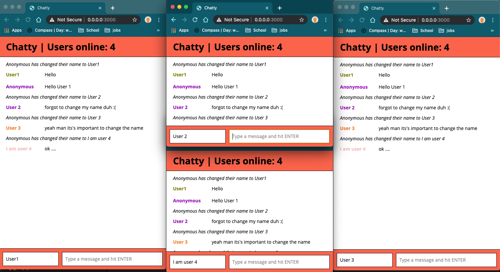

# Chattr App

A simple chat app with a React front-end and a Web Socket Server back-end;

==========================================

## Getting Started

1. Install dependencies using the `npm install` command.
2. Start the web server using the `npm run local` command. The app will be served at <http://localhost:3000>.
3. Go to <http://localhost:3000> in your browser.

==========================================

## Dependencies

- React
- Webpack
- [babel-loader](https://github.com/babel/babel-loader)
- [webpack-dev-server](https://github.com/webpack/webpack-dev-server)
- Express
- Uuid
- WSS

==========================================

## Product Screenshots

### Chattr user interaction snap shots

==========================================

## Future Features To Come

- Notifcation to all connected clients when a client closes their browser window
- Allow images to be added to chats
- Giphy API Integration
- Custom Emojis
- UserName colors are calculated algorithmically based on their name, or is manually selectable by users
