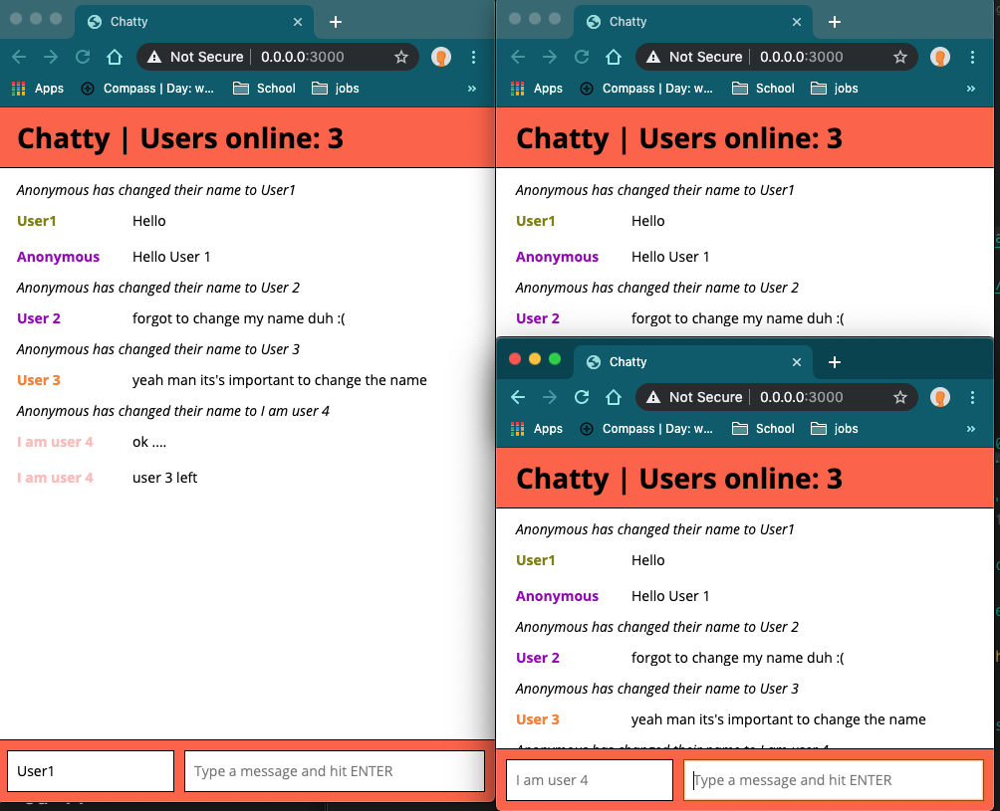
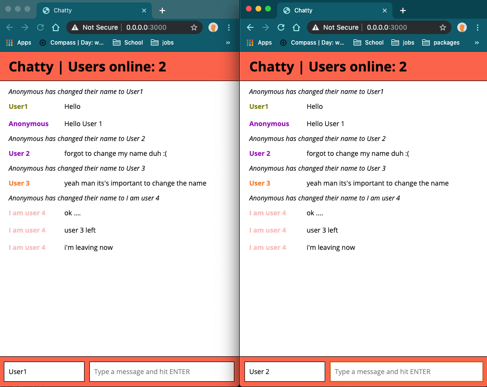
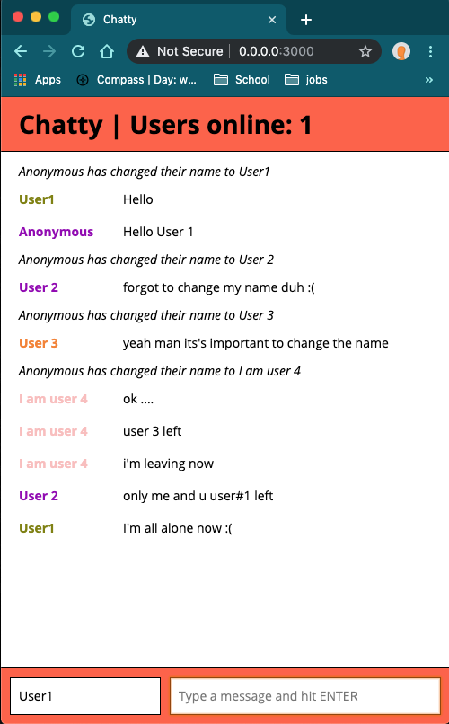

# Chattr App

==========================================

## Getting Started

1. Install dependencies using the `npm install` command.
2. Start the web server using the `npm run local` command. The app will be served at <http://localhost:3000>.
3. Go to <http://localhost:3000> in your browser.

==========================================

### Dependencies

- React
- Webpack
- [babel-loader](https://github.com/babel/babel-loader)
- [webpack-dev-server](https://github.com/webpack/webpack-dev-server)

==========================================

## Product Screenshots

### Chattr user interaction snap shots

